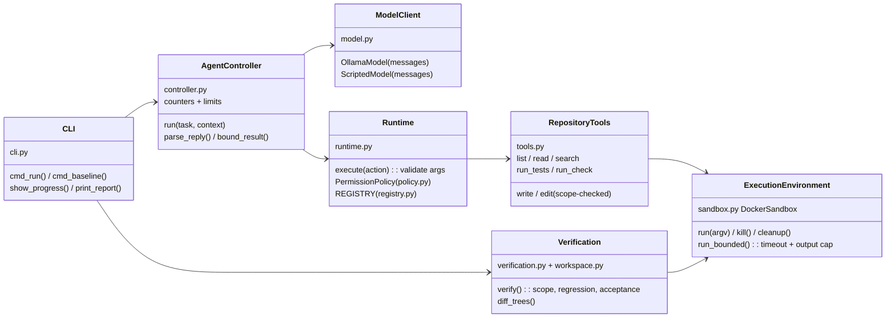
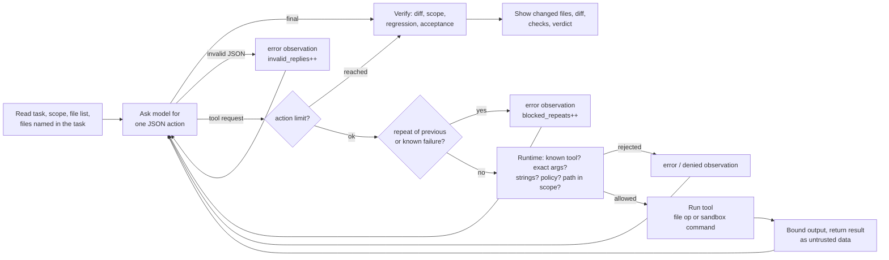
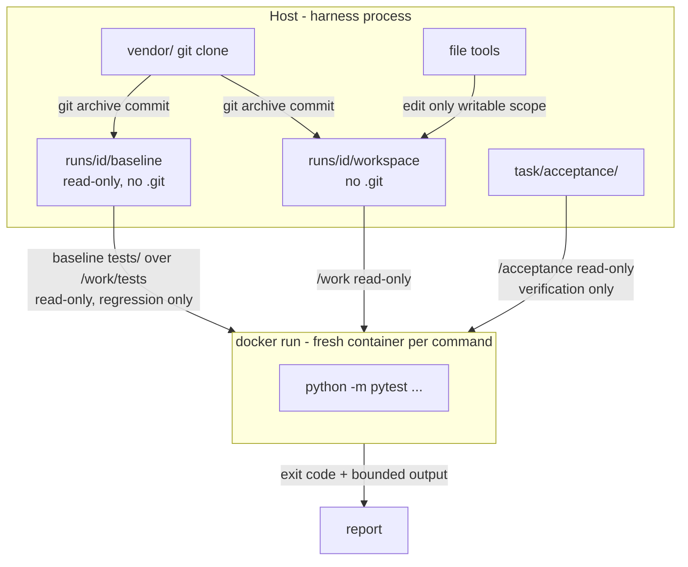

# Stage 1 — a working coding harness

A small coding harness written in Python. It takes a bug-fix request and
asks a local LLM (Ollama, `qwen2.5-coder:7b`) what to do. Every request the
model makes is checked, allowed tools run on a disposable copy of the target
repository, and code and tests run inside a Docker sandbox. When the loop
stops, the harness verifies the result on its own: it shows the changed files,
the diff and every check result, whatever the model claims.

The harness uses only the Python standard library and no agent framework.
It reuses and extends the controller, registry and permission ideas from the
Week 1 lab (`../ollama-lab/my-agent`).

## Authors and contributions

- **Federico Magri**: individual submission. Chose the target and the task,
  reviewed the design, the code, the diffs and test results, ran the demo and
  recorded the video.
- **AI assistance**: Claude Code (Anthropic) was used as a coding assistant
  to write most of the harness code, the tests and this README. All of it was
  reviewed, run and verified.

## Target and task

| | |
|---|---|
| Repository | [cosmicpython/code](https://github.com/cosmicpython/code) (allocation service from *Architecture Patterns with Python*) |
| Starting commit | `14c84797ffa77255d53cf1a02fe6aafda2b68aeb` (master, 2025-06-10) |
| Modules involved | `domain/model.py` (Product, Batch), `service_layer/handlers.py` + `messagebus.py`, `adapters/orm.py` + `repository.py`, `views.py` (read model) |
| Request | [`task/request.md`](task/request.md): allocating the same order line twice must be idempotent ([`request-guided.md`](task/request-guided.md) adds a reviewer hint) |
| May change | `src/allocation/**/*.py` only; `tests/**`, `setup.py`, `requirements.txt`, Docker files are protected |
| Acceptance check | [`task/acceptance/test_idempotent_allocation.py`](task/acceptance/test_idempotent_allocation.py), outside the workspace |
| Regression check | the repository's own `tests/unit` + `tests/integration` (26 tests) |

**The bug.** If the same `Allocate` command arrives twice (for example, the
broker redelivers a message), `Product.allocate` allocates it again. It emits
a second `Allocated` event, so the message bus runs the read-model handler
twice and `views.allocations()` returns a duplicate row. The event is also
published twice. If the first batch is already full, the line reserves stock
in a *second* batch. The business rule: an order line is allocated at most
once. The fix belongs in the domain model, but the failure shows up across
the message bus, the handlers, the ORM/unit of work and the read model.
The acceptance check tests both levels.

**Starting state** (`python -m harness baseline`): acceptance **fails** (4
failed, 2 passed), regression passes (26 passed). Two existing tests need
Postgres or a mail server and are excluded explicitly (see
`task/target.toml`). They need services the repository starts with
docker-compose, and the sandbox has no network.

## Setup

Requirements: Python ≥ 3.11, Git, Docker, and Ollama for real runs. There is
nothing to `pip install` on the host (see `requirements.txt`).

```bash
ollama pull qwen2.5-coder:7b
cp settings.example.toml settings.toml   # optional; the example values are used otherwise
python3 -m harness prepare               # clone target @ pinned commit into vendor/, build sandbox image
```

No secrets are needed. `settings.example.toml` holds the model name, the
endpoint, the limits and the sandbox resources.

## Run

```bash
python3 -m harness baseline                          # all checks on the untouched code (acceptance must fail)
python3 -m harness run                               # agent + real model on task/request.md, then verification
python3 -m harness run --script scripts/reference-fix.json   # same pipeline with scripted replies (no model)
python3 -m harness run --mode read-only              # only list/read/search/run tools
python3 -m harness verify runs/<id>                  # re-verify an earlier run
python3 -m unittest discover -s tests -t . -v        # automated tests
```

Options for `run`: `--model NAME`, `--max-actions N`, `--tools a,b,c`,
`--task-file FILE`, `--label NAME`. `scripts/demo.sh` runs the whole demo
sequence.

The output shows progress for each action (request, status, short result),
then the termination reason and counters, the model's final message
(labelled *unverified*), the commands the agent really ran, the changed
files, the colored diff and the check table with a verdict. A failing,
timed-out or unavailable check is printed with its output, and the verdict
is `NOT VERIFIED`. Each run is kept in `runs/<id>/`:

| File | Content |
|---|---|
| `workspace/` | the agent's copy after the run |
| `baseline/` | read-only copy of the starting commit |
| `diff.patch` | unified diff baseline → workspace |
| `report.json` | counters, termination, checks with exit codes and output |
| `trace.jsonl` | one event per line (requests, results, checks) |
| `transcript.json` | every message exchanged with the model |

`baseline/` is read-only on purpose. To delete old runs, use `chmod -R u+w runs && rm -rf runs`.

## Architecture



| Responsibility (handout Fig. 2) | Implementation |
|---|---|
| UserInterface | `harness/cli.py` — `prepare`, `baseline`, `run`, `verify` |
| AgentController | `harness/controller.py` — loop, reply parsing, limits, counters |
| ModelClient | `harness/model.py` — `OllamaModel` (JSON mode, temperature 0, timeout), `ScriptedModel` |
| Validation and permissions | `harness/runtime.py`, `harness/policy.py`, `harness/registry.py` |
| RepositoryTools | `harness/tools.py` |
| ExecutionEnvironment | `harness/sandbox.py` (+ `sandbox/Dockerfile`) |
| Verification | `harness/verification.py`, `harness/workspace.py` |
| Initial context | `harness/context.py` — file list, writable scope, content of files named in the task |
| Settings and task | `harness/config.py`, `settings.example.toml`, `task/target.toml` |

### The loop



The loop stops on: `final`, `action_limit` (`max_actions` tool requests),
`denied_limit`, `invalid_limit`, `model_error` (after `max_model_retries`
retries) or `cancelled` (Ctrl+C). Verification runs after *every*
termination, not only after `final`.

### Execution and verification



## Safety controls

| Concern | Control (in application code, not in the prompt) |
|---|---|
| Disposable copy | Each run exports the pinned commit into `runs/<id>/workspace`. There is no `.git` in it, so nothing can push, merge or rewrite history. |
| File scope | Paths are relative and resolved; `..`, absolute paths, hidden files and symlinks leading outside are denied. Writes must match `writable` and must not match `protected`. |
| Same scope for execution | The sandbox mounts only the workspace (read-only) at `/work`. Host files, the home directory and `.git` are not visible. |
| Contained execution | `docker run --rm --network none --read-only --cap-drop ALL --security-opt no-new-privileges --pids-limit --memory --cpus --user uid:gid`, plus a 64 MB tmpfs `/tmp`. |
| Credentials | The container gets an explicit 6-variable environment, never the host's. The model needs no API key. |
| Stuck commands | A harness-side timeout runs `docker kill` and kills the client process group. `--rm` removes the container, and a cleanup pass removes leftovers labelled with the run id. Because the workspace is read-only inside the sandbox, a killed command cannot leave further writes behind. |
| Push / merge / deploy | Disabled: there is no git, no network and no generic shell tool. The only commands are `run_tests` (pytest under `tests/`) and named checks from `task/target.toml`. |
| Untrusted input | Model replies are parsed as JSON and validated: known tool, exact argument names, strings, length limit. Tool results go back as user-role data marked untrusted. |
| Tests cannot be gamed | `tests/**` is protected. Regression runs with the *baseline* copy of `tests/` mounted over the workspace's, and the acceptance check stays outside the workspace and hidden from the agent. |
| Model claims | The final message is printed as an unverified claim. The verdict comes only from checks the harness runs itself, and the commands the agent ran are listed from the runtime's own record. |

### Limits and counters

| Setting | Default | Effect |
|---|---|---|
| `limits.max_actions` | 20 | tool requests per run (executed, denied or blocked); the next request is refused |
| `limits.max_denied` | 5 | denied requests before the run stops |
| `limits.max_invalid_replies` | 4 | malformed replies before the run stops |
| `limits.max_model_retries` | 2 | extra attempts per failed model request |
| `limits.observation_chars` | 8000 | one tool result sent to the model; longer results are cut and marked `observation shortened` |
| `sandbox.command_timeout_s` | 120 | a command running longer is killed and reported as `timeout` |
| `sandbox.output_bytes` | 16000 | captured command output; head and tail are kept around an `output shortened` marker |
| file tools | 12 000 chars / 300 files / 50 matches | marked `SHORTENED` / `truncated` |

Every run reports these counters: `actions`, `executed`, `denied`, `errors`,
`invalid_replies`, `blocked_repeats`, `model_calls` and `model_retries`.

## Tests

`python3 -m unittest discover -s tests -t . -v` runs 59 tests. The core tests
use scripted model replies and need no model and no API key. The Docker and
bug-fix tests are skipped automatically when the sandbox image or target is
missing.

| Required test | Where |
|---|---|
| File tools: read, search, edit; reject outside paths | `tests/test_tools.py` (`..`, absolute, hidden, symlink, protected, out of scope, read-only mode) |
| Controller: scripted reply → correct tool → result | `tests/test_controller.py::ControllerTest` |
| Invalid request: unknown tool / bad args → clear error, nothing executed | `tests/test_controller.py::InvalidRequestTest` (a spy tool proves no execution) |
| Failed command: nonzero exit and output visible, no false pass | `tests/test_failed_command.py` (the model claims "All tests pass", the verdict is still `not verified`; also `unavailable` and `timeout` checks) |
| Action limit | `tests/test_limits.py::ActionLimitTest` (repeating reply stops at the limit; repeats are not re-executed) |
| Output limit | `tests/test_limits.py::OutputLimitTest` (command output, observations, file reads) |
| Bug fix | `tests/test_bugfix.py` (real repo copy + Docker: acceptance fails before, passes after, regression passes, only `model.py` changed) |
| Extra: sandbox | `tests/test_sandbox_docker.py` (no network, read-only workspace, no host env, stuck command killed and container removed, bounded output) |
| Extra: other limits | denied limit, invalid-reply limit, model retries, Ctrl+C, stuck process tree killed, no writes after timeout |

## Demo with a real model

Recorded runs with `qwen2.5-coder:7b` on CPU. The commands, diffs, check
output and logs are in [`docs/demo-results.md`](docs/demo-results.md) and
[`docs/evidence/`](docs/evidence/).

| Run | Request | Model's claim | Harness verdict |
|---|---|---|---|
| 1 | `task/request.md` | none (looped on searches, cancelled with Ctrl+C) | NOT VERIFIED |
| 2 | `task/request.md` | "The change is complete" (no-op edit) | NOT VERIFIED — acceptance 4 failed |
| 3 | `task/request-guided.md` | "regression check passed" | **PASSED** — acceptance 6/6, regression 26/26 |

**Manual help:** run 3 adds a reviewer hint to the request that says where
the check belongs and which lines to use for `edit_file`. The model made the
edit itself, and no file was changed by hand. Reproduce it with
`python3 -m harness run --task-file task/request-guided.md`.

## Known limitations

- A 7B model on CPU is slow (20–150 s per model call) and unreliable at precise
  edits. The harness keeps every failure visible, but it cannot make the model
  succeed. A larger model only needs `--model`.
- Docker is the security boundary. It is a strong default, not a VM: a kernel
  escape would bypass it.
- Two of the target's 28 tests need Postgres or a mail server and are
  excluded. The end-to-end tests (`tests/e2e`) need the full docker-compose
  stack and are not run.
